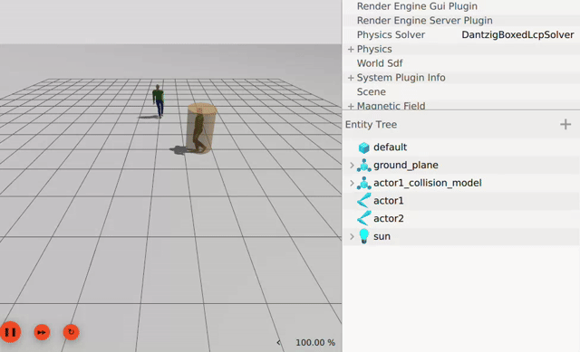

# Gazebo Classic SFM Plugin for ROS2

<p align="center">
  
</p>

This is the ROS2 version of the Gazebo Classic SFM Plugin, with collisions added (which can be scanned by LiDAR).

## References

Thanks for the following prior works:

- [gazebo_sfm_plugin](https://github.com/robotics-upo/gazebo_sfm_plugin)

- [lightsfm](https://github.com/robotics-upo/lightsfm)

- [turtlebot3_simulations_jp_custom](https://github.com/ROBOTIS-JAPAN-GIT/turtlebot3_simulations_jp_custom)

- [gazebo_sfm_tb3_ros2](https://github.com/koichirokato/gazebo_sfm_tb3_ros2)

- [sfm_for_gazebo](https://github.com/tech-life-hacking/sfm_for_gazebo)

- [gazebo-actor](https://github.com/BruceChanJianLe/gazebo-actor)

- [ros_motion_planning](https://github.com/ai-winter/ros_motion_planning)

## Quick Start

My environment is Ubuntu 22.04 with **Gazebo 11** and **ROS2 Humble**.

1. Clone the repository into your ROS2 workspace:

   ```bash
   cd ~/ros2_ws/src
   git clone https://github.com/robotics-upo/gazebo_sfm_plugin_ros2.git
   ```

2. Build the workspace:

   ```bash
   colcon build --symlink-install
   ```

3. Source the workspace:

   ```bash
   source ~/ros2_ws/install/setup.bash
   ```

4. Run the demo:

   ```bash
   ros2 launch gazebo_classic_sfm_plugin_ros2 sfm.launch.py
   ```
